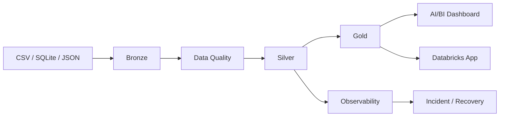

# Andes Commerce Data Platform

> **¿Qué problema resuelve?** Andes Commerce tiene ventas, clientes e inventario repartidos entre varias fuentes. Esto provoca reportes inconsistentes, trabajo manual y poca trazabilidad.
>
> **¿Qué construí?** Una plataforma E2E que ingiere fuentes independientes, valida calidad, transforma datos en un Lakehouse y publica modelos Gold para decisiones comerciales.
>
> **¿Qué demuestra?** Python + SQL + PySpark + Databricks + Delta + Data Quality + observabilidad + AI/BI + Databricks App.

## En 30 segundos

### Resultado de negocio

La solución permite responder preguntas como:

- ¿Qué categorías venden más y cuáles pierden margen?
- ¿Qué tiendas presentan riesgo de stock?
- ¿Qué clientes generan mayor valor?
- ¿Son confiables los datos publicados?
- ¿Qué ocurrió cuando un pipeline falló?

### Alcance técnico

| Área | Implementación |
|---|---|
| Ingesta | Python + fuentes CSV/JSON/SQLite |
| Procesamiento | PySpark / Spark |
| Lakehouse | Databricks + Delta |
| Capas | Bronze / Silver / Gold |
| Calidad | Data Contracts + DQ + quarantine |
| Modelado | Facts + Dimensions + Business Marts |
| Analytics | Databricks SQL + AI/BI |
| Aplicación | Databricks Apps / Streamlit |
| Operaciones | Run IDs + metrics + incidents + runbooks |
| Calidad de código | Pytest + GitHub Actions |

## Arquitectura

La solución está diseñada con una restricción realista: el procesamiento pesado no se ejecuta en el equipo local. Python, SQLite y datasets pequeños se utilizan localmente; Spark y Databricks se utilizan en cloud.

## Repositorio

- `generators/`: un generador independiente por tabla.
- `src/`: ingesta, calidad y transformaciones.
- `databricks/`: notebooks PySpark y SQL para el Lakehouse.
- `sql/`: preguntas y reconciliaciones de negocio.
- `dashboard/`: diseño de AI/BI.
- `app/`: Operations Control Center.
- `observability/`: runs, métricas y DQ.
- `incidents/`: incidentes simulados.
- `runbooks/`: diagnóstico y recovery.
- `docs/`: negocio, arquitectura, datos y entrevistas.

## Demo

1. Ejecutar los generadores.
2. Ejecutar Bronze → DQ → Silver → Gold localmente.
3. Ejecutar los notebooks de Databricks.
4. Construir el AI/BI Dashboard.
5. Abrir la Databricks App.
6. Revisar el incidente simulado y su recovery.

## Entrevista

Este repositorio incluye preguntas específicas sobre:

`SQL · Python · ETL/ELT · Spark · Databricks · Data Quality · Data Modeling · Arquitectura · Observabilidad · Troubleshooting · Consultoría`

## Nota de alcance

Es un proyecto de portfolio con datos sintéticos. No se presenta como un sistema productivo real. Las decisiones están documentadas para demostrar criterio técnico, trade-offs y capacidad de explicar una solución E2E.
